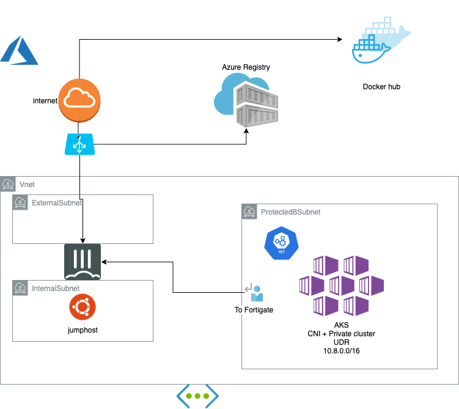

# Using your own az cli and jumphost 

Depending on your environement you will need Azure cli (Ansible at least 2.9 is good to have but optionnal)

This section assume you already run:
```shell
git clone https://github.com/fortinet-solutions-cse/secured-AKS-refarch
cd secured-AKS-refarch
```
## Script to set the architecture

You can customize region and name of the resource group if necessary (shared accounts for example). You must be able to manage service principals

Warning if you want to effectively change region you must update region parameter in myparameters.json file

```shell
az login
export GROUP_NAME="ftnt-demo-aks"
export REGION="westeurope"
./Step1-FortigateAndNetworks.sh
```
This deploy a single fortigate VM with predefined setup. To login fgtadmin/Fortin3t-aks to the fortigate. It can be replaced by a more advanced Fortigate in HA, scalable transit etc..
Depends on Fortinet generic blueprint : https://github.com/fortinet/azure-templates


```shell
./Step2-PrivateAKS.sh 
```
This second part has been kept in a small script and readable commands so that you can check the differents steps and options by yourself more easily.


This deploy a jumphost VM in the transit area for convenience. 
A AKS with the following options:

- enable-private-cluster 
- network-plugin azure 
- generate-ssh-keys
- outbound-type userDefinedRouting

The result is a fully private setup (API and nodes) and ensuring there is firewall observability and prevention on outbound an inter-nodes traffic.


## Fortigate setup from you client (laptop)

If you prefer to run from the jumphost see at the end of this doc.

In addition you must install Fortigate support for Ansible:
```shell
ansible-galaxy collection install fortinet.fortios
```

Apply configuration to the FGT.
Replace the IP with the public IP of your fortigate. You may need to retry if experiencing a timeout.
```shell
ansible-playbook fgt-playbook.yaml -i hosts -e ansible_host=52.174.188.48
```

## Connect to the jumphost

If you want to use the jumphost in this setup, You can either use Azure BASTION access (not setup by default) or there is a redirection on the Fortigate.
Find the Fortigate public IP (output of script or portal).
```shell
ssh azureuser@<FGT IP> -p 2222
```
Password is "Fortin3t-aks".
To setup the Jumphost once logged on it:
```shell
git clone https://github.com/fortinet-solutions-cse/secured-AKS-refarch
cd secured-AKS-refarch/jumphost
./configure-clis.sh 
export GROUP_NAME="ftnt-demo-aks"
export REGION="westeurope"
az login
# log this as device on microsoft portal
./collect-configurations.sh
```

Kubectl commands should work from this cli after this stage.


If returning information you are good to go for the hands on demos part.
It is an supported AKS so you can also follow [AKS Tutorial](https://docs.microsoft.com/en-us/azure/aks/tutorial-kubernetes-prepare-app)

# Optionnal 


## running Ansible from the jumphost


Once Step2 is completed:
On the portal you can find the jumphost public IP and directly connect to it.

Or you can ssh to the fortigate (fgtadmin/Fortin3t-aks) from there:
```shell
exec ssh azureuser@172.27.40.73
```

**Run the setup jumphost paragraph** , then run the ansible commands from the jumphost.

## add Windows based nodepool

```shell
export GROUP_NAME="ftnt-demo-aks"
export REGION="westeurope"
./Step3-WindowsNodes.sh
```

# Cleaning

Remove the resource group on the portal or:
```shell
az group delete -g $GROUP_NAME -y
```

TODO: add service principal rm