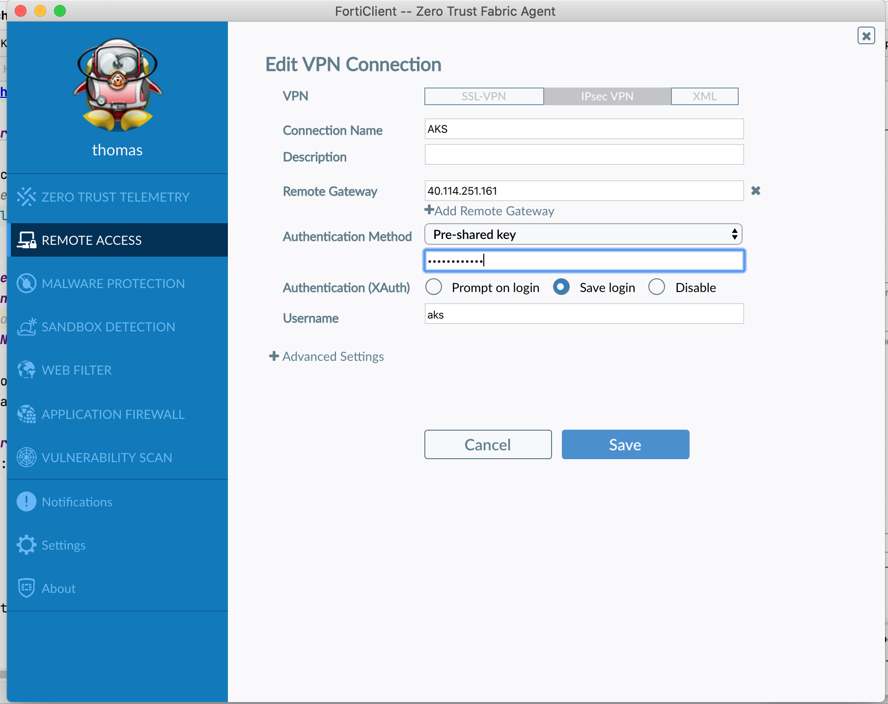

# CLI with the provided docker image
```shell
docker run -v $PWD:/Azure/  -i --name az-aks-cli  -h az-aks-cli -t fortinetsolutioncse/az-aks-cli
```

Type the rest of the commands in a shell inside the docker runtime.

## optionnal
If like me you have internal SSL inspection you use the same image.
(Curious check the code).

```shell
export FGTCA=$(base64 Fortinet_CA_SSL.cer -b0)
# this is for MacOS use -w0 on Linux
docker run -v $PWD:/Azure/ -e FGTCA -i --name az-aks-cli  -h az-aks-cli -t fortinetsolutioncse/az-aks-cli
```

# Fortigate and networks
You can customize region and name of the resource group if necessary (shared accounts for example). You must be able to manage service principals
```shell
az login
export GROUP_NAME="ftnt-demo-aks"
export REGION="westeurope"
./Step1-FortigateAndNetworks.sh
```
This deploy a single fortigate VM with predefined setup. To login to the fortigate use fgtadmin/Fortin3t-aks.

It can be replaced by a more advanced Fortigate in HA, scalable transit etc..
Depends on Fortinet generic blueprint : https://github.com/fortinet/azure-templates

# AKS/ACR architecture 
```shell
export GROUP_NAME="ftnt-demo-aks"
export REGION="westeurope"
./Step2-PrivateAKS.sh 
```

This second part has been kept in a small script and readable commands so that you can check the differents steps and options by yourself more easily.


This deploy a jumphost VM in the transit area for convenience. 
A AKS with the following options:

- enable-private-cluster 
- network-plugin azure 
- generate-ssh-keys
- outbound-type userDefinedRouting

The result is a fully private setup (API and nodes) and ensuring there is firewall observability and prevention on outbound an inter-nodes traffic.


## Fortigate setup
Apply configuration to the FGT.
Replace the IP with the public IP of your fortigate. You may need to retry if experiencing a timeout.
```shell
ansible-playbook fgt-playbook.yaml -i hosts -e ansible_host=52.174.188.48
```


## VPN to Fortigate

The Fortigate has been setup (Ansible) to accept a VPN IpSec to the environment. (recommended)
Setup Forticlient IPSec client on your laptop with the public IP of the Fortigate:

- psk: Fortin3t-aks
- user: aks
- password: Fortin3t-aks



# Access the environment

Kubectl commands should work after this stage.

# Use AKS

Try to run kubectl commands:
```shell
kubectl cluster-info
```

If returning information you are good to go for the hands on demos part.
It is an supported AKS so you can also follow [AKS Tutorial](https://docs.microsoft.com/en-us/azure/aks/tutorial-kubernetes-prepare-app)

# Optionnal 

## add Windows based nodepool

```shell
export GROUP_NAME="ftnt-demo-aks"
export REGION="westeurope"
./Step3-WindowsNodes.sh
```

## Use Lens

Thanks to the vpn you can direclty and easily use [Lens](https://k8slens.dev/) directly on you laptop.

# Cleaning

Remove the resource group on the portal or:
```shell
az group delete -g $GROUP_NAME -y
```